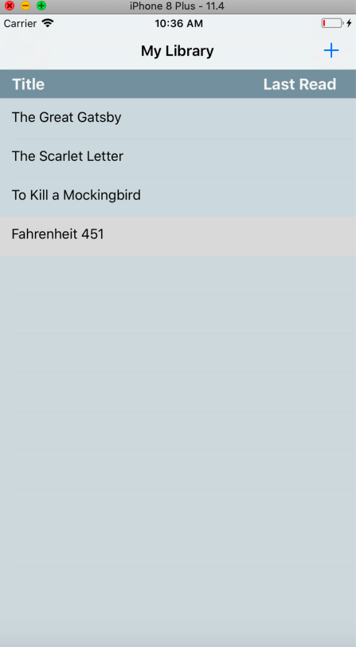
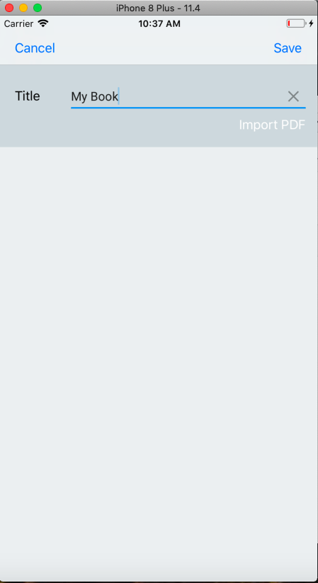
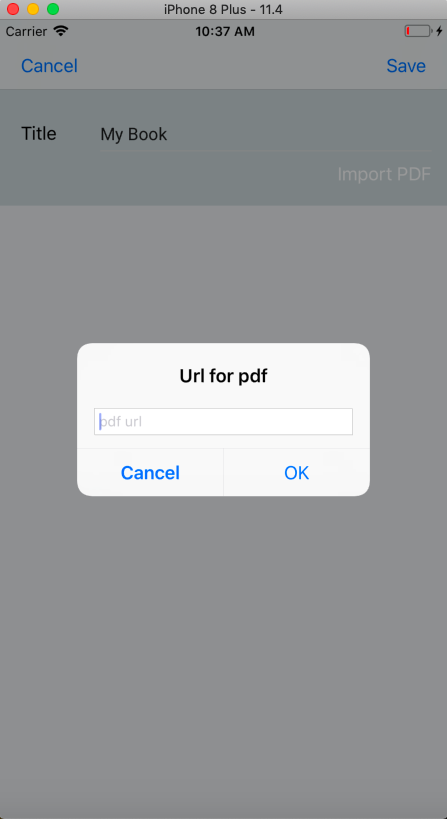
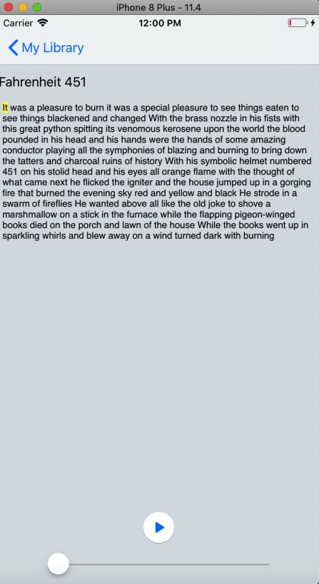
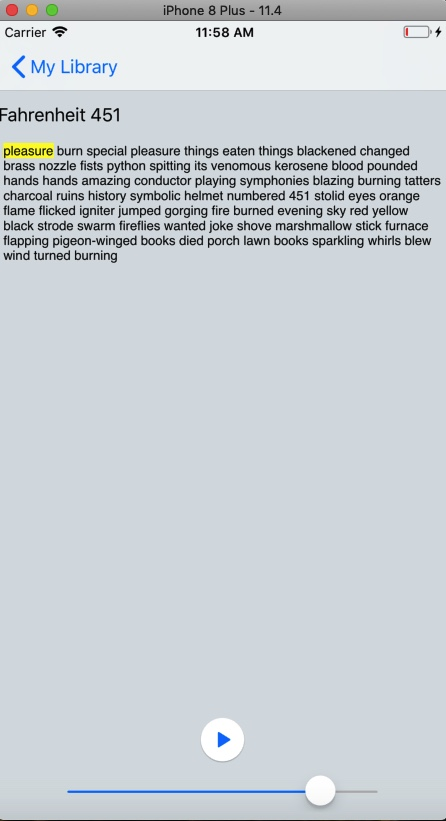
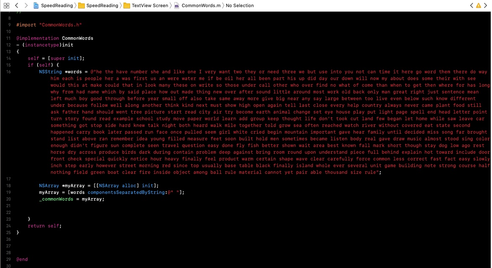
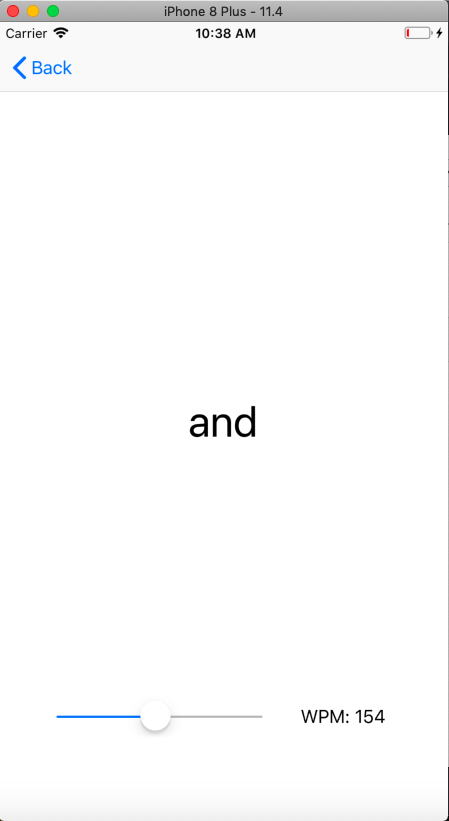

# SpeedReadingMidtermProject

The 'Read for Speed' app let's the user practice their speed reading.
- Home view displays the users previously read texts

- Import screen allows users to copy and paste texts with accompanying title to save for later, or to import texts as PDF

 

- Textview screen displays the text with an adjutable word filter UISlider, which when adjusted removes the appropriate number 
of 'common words' from the text, theoretically leaving the most important words behind

 

- Custom filter is a slightly modified list of the 300 most common words in the english language, the modification being a 
personal redaction of words on this list that although common I deemed to likely be key words in a text

- Reading screen displays the desired text one word at a time, with another UISlider to decide speed

